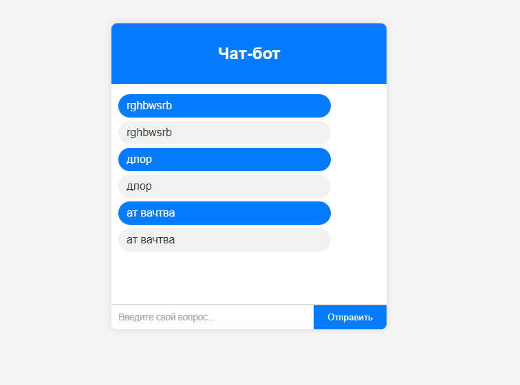
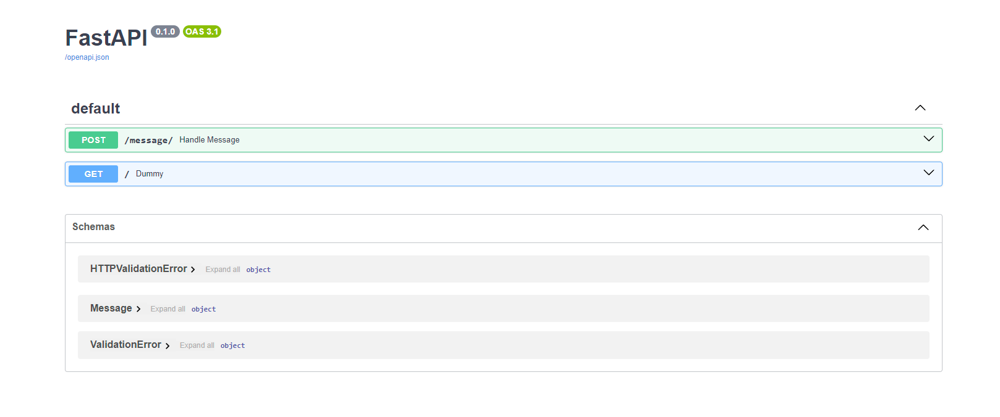

# Чат-бот AI Talent Hub

## Использованные технологии

- **Front-end:**
  - React.js

- **Back-end:**
  - FastAPI

## Установка

To set up the project locally, follow these steps:

1. **Клонировать репозиторий:**

   ```bash
   git clone https://github.com/greatwormhole/AITalentHub-8-We-are-five.git
   ```

2. **Настроить проект:**

    Перейти в склонированный репозиторий:
    ```bash
    cd AITalentHub-8-We-are-five
    ```

    Опционально изменить переменные окружения в файлах ```docker.env```, ```src/backend/.env/``` или ```src/frontend/.env```

3. **Запустить приложение:**
    ```bash
    bash lauch.sh
    ```

## Использование

<div style="text-align: center;">
  
  
</div>